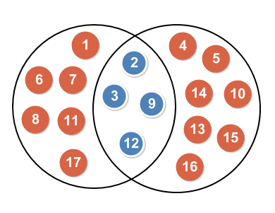

# Find Out The Same Elements From Two Arrays

## Content

- [Question](#question)
- [Solution](#solution)
- [Core Implementation](#core-implementation)

## Question

There is an array of string stored in `strArr` and it contains two elements. One element is a string which represents a series of comma-separated numbers. The other is also a string which represents another series of comma-separated numbers. These numbers are all sorted in ascending order. Now, your mission is to find out those numbers existed in both two string elements, in other words, to find out an intersection of these two series of numbers, and put these numbers together in a comma-separated and ascending order in a string. If there is no qualified numbers you can find, then return a string "**false**".

**Example 1**:

Input: {"1, **6**, 7, **9**, 21, 22, **30**, **50**", "2, 3, **6**, 8, **9**, 10, 20, **30**, 40, **50**"}

Output: "6, 9, 30, 50"

**Example 2**:

Input: {"1, 6, 9", "5, 6, 7"}

Output: "6"

**Example 3**:

Input: {"2, 4, 6, 8", "1, 3, 5, 7"}

Output: "false"

## Solution

*I definitely sure that there must be some much more efficient solution to solve this problem. Discussion on performance is not the focus of this post.*

So let's simplify the issue a little bit. It sounds like to find one thing from another group of things.



### Solution - Mapping and Containing statement

The steps to solve this question:

- Split each string into an array of Integer.
- Create a **HashSet**, and populate the HashSet with the integer elements.
- Iterate elements of one integer array and try them one by one with `Set.contains(obj)`. If *true*, it means that the element is contained by the other array (intersection).

**Comments:**

In the former time, I tried `List.contains(obj)` as a statement to evaluate the intersection. But later I realized there was a serious performance issue by this approach. The time complexity of `List.contains()` is **O(n)**, while `hashSet.contains()` is **O(1)**. Therefore, Set should be a better data structure for this solution.

## Core Implementation

```java
//Convert two elements into two lists of numbers.
String[] testStrArr = Arrays.stream(strArr[0].split(","))
        .map(String::trim).toArray(String[]::new);
String[] targetStrArr = Arrays.stream(strArr[1].split(","))
        .map(String::trim).toArray(String[]::new);
Set<String> targetStrSet = Set.of(targetStrArr);

//Evaluate Set.contains(obj) statement
List<String> intersection = Arrays.stream(testStrArr)
        .filter((e) -> targetStrSet.contains(e))
        .collect(Collectors.toList());

//Output
StringBuilder sb = new StringBuilder();
intersection.forEach(str -> sb.append(",").append(str));
if (sb.length() > 0) {
    System.out.print(sb.deleteCharAt(0).toString());
} else {
    System.out.print("false");
}
```
