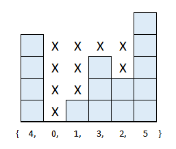
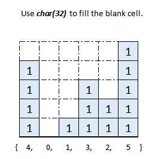
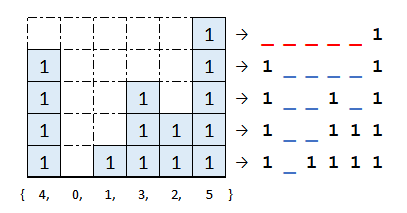

# How much rainfalls can be trapped by buildings

## Content

- [Question](#question)
- [Solution](#solution)
- [Core Implementation](#core-implementation)

## Question

Have the function `calculateRainfalls(arr)` take the array of non-negative integers stored in `arr`, and determine the largest amount of water that can be trapped. The numbers in the array represent the height of a building (where the width of each building is 1). And if you imagine that it is raining, water will be trapped between the two tallest buildings. For example, the array is {4, 0, 1, 3, 2, 5}, and then the building will look like:



The `X` mark marks how much rainfalls trapped by buildings. So, from the above picture, the rainfalls amount we can get is 10 (measurement unit doesn't matter).

## Solution

*I definitely sure that there must be some much more efficient solution to solve this problem. Discussion on performance is not the focus of this post.*

I would love to go for a VISUAL COUNTING (not really) solution to solve this riddle. Beforehand, let's re-draw the above picture with 1 and a space character, and put them all into a matrix.



I will give you an explain later why a space is used here to fill up the blanks in the matrix.

Okay, now here's the five strings we can get from the matrix:



We can easily find out the amout of all spaces marked in **BLUE** is the answer to this problem. Let's look back the reason why I used spaces to fill up the blanks. It just because I can get rid of all spaces in **RED** easily by calling the String's `trim()` method.

## Core Implementation

### Get the height of the highest building

```java
int maxHeightOfBuilding = Arrays.stream(arr).max().getAsInt();
```

### Prepare Strings to represent the  status of each layer of the buildings

```java
for (int i = 0; i < maxHeightOfBuilding; i++) {
    for (int j = 0; j < numOfBuildings; j++) {
        String stuffChar = arr[i] > i ? "1" : " ";
        sb.append(stuffChar);
    }
    sb.append(",");
}
```

### Count available spaces

```java
rainfalls = 
    strs.stream().map(str -> str.trim())
                 .map(str -> str.chars().filter(c -> c==32).count())
                 .reduce(rainfalls, Long::sum);
```


